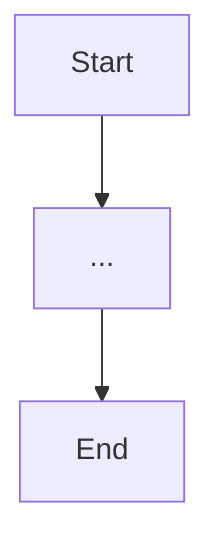

# Feature Planning — Skill

## Purpose

This skill defines the PLAN.md format and planning process for the `trading-bot-agent` Python project.

---

## PLAN.md Template

````markdown
---
version: 1.0
date: [ISO date]
author: running-prompt
status: Draft | In Progress | Completed | Rejected
python_version: "3.11"
module: trading-bot-agent
ticket: [TICKET-ID or N/A]
---

# Feature Plan: [Feature Name]

## §1 Goal

[1–3 sentences: what this feature does and why it exists]

**Non-goals:**

- [what this explicitly does NOT do]

## §2 Architecture Overview

### Flow Diagram


````

### Key Decisions

| Decision | Choice | Rationale |
| -------- | ------ | --------- |
| ...      | ...    | ...       |

## §3 Tech Stack Changes

| Component | Before | After |
| --------- | ------ | ----- |
| ...       | ...    | ...   |

New dependencies (add to requirements.txt / pyproject.toml):

- `package==version` — reason

## §4 Project Structure Changes

```
# Only list new or modified files
tradingagents/
  agents/
    [new_agent]/
      new_file.py     ← NEW: purpose
  integrations/
    existing_file.py  ← MODIFIED: add X function
tests/
  test_new_feature.py ← NEW: unit tests
```

## §5 Implementation Tasks

### Dependency Graph

```
Task 1 ──► Task 2 ──► Task 3
              │
              └──► Task 4 (parallel with 3)
                      │
                      └──► Task 5
```

### Task Definitions

#### Task 1 — [Name]

**Scope:** `[file paths]`
**Description:** [what to implement]
**Validation:**

- `pytest tests/test_X.py -v`
- `python -m py_compile tradingagents/X.py`
  **Status:** Not Started | In Progress | Completed | Blocked

#### Task 2 — [Name]

[same structure]

## §6 Task Summary

| #   | Task Name | Files | Tests | Status |
| --- | --------- | ----- | ----- | ------ |
| 1   | ...       | ...   | ...   | ...    |

## §7 Validation Plan

```bash
# Full validation sequence
pytest tests/ -v --cov=tradingagents --cov-report=term-missing
mypy tradingagents/ --ignore-missing-imports
flake8 tradingagents/ tests/ --max-line-length 120
black --check tradingagents/ tests/ cli/
```

Minimum coverage gate: **80%** on changed files.

## §8 Rollback Plan

[How to revert: which files to restore, which migrations to undo]

## §9 Remediation Log

[Added during Step 5 — issues found and fixed during review]

## §10 Deep Knowledge Reference

[Optional: spec details, API contracts, external docs links]

```

---

## Planning Rules

1. **PLAN.md is MANDATORY.** No implementation starts without an approved plan.
2. **One task = one focused unit.** Each task touches 1–3 files maximum.
3. **First task** = scaffold (directory, skeleton, imports, no logic).
4. **Last task** = tests + documentation + final validation run.
5. **Each task** must have explicit validation commands.
6. **Blocked tasks** must be documented with blocker reason before proceeding.
7. **Deviations** from the plan must be recorded in §9 Remediation Log.

---

## Trading Bot Feature Checklist

Before writing PLAN.md, verify the feature handles:

- [ ] Ticker input validation via `safe_ticker_component()`
- [ ] Error handling for LLM failures (retry logic)
- [ ] Graceful degradation when external APIs are unavailable
- [ ] Cache invalidation if data freshness is a concern
- [ ] Logging with structured fields (no secrets)
- [ ] Configuration exposure via `default_config.py`
- [ ] Telegram notification hook (if user-visible events are generated)
- [ ] Unit test coverage for happy path and error path
- [ ] Integration test for the new graph node (if adding a graph node)
```
